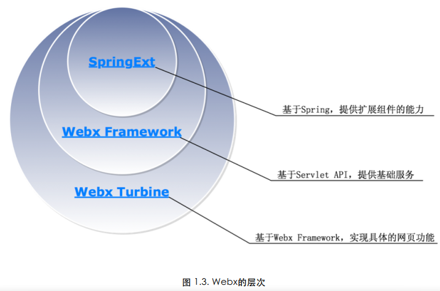

# Webx

## 一、前述

webx是一个拓展spring容器（SpringEXT）、完善请求request、response等web属性的集成web环境的框架。以下是webx框架的层次图：



如图所示，webx基于Spring容器，在实现bean注入的同时使用了springext拓展了其功能，为后面流程执行打好基础，随后通过使用自己实现的webx Framework（增强了web各种属性）提供web的基础服务，在此基础上使用webx Turbine实现具体的网页功能。

## 二、SpringEXT

在传统的spring中，配置bean时需要知道注入的这个类需要指定实现类是什么，使用什么参数，如下一段配置中，你需要知道key、name等属性值，这样给我们编程时造成的负担太大，更是因为不符合OCP原则（不必修改源代码、或完全了解源代码的情况下改变模块的行为）。

```xml
<bean id="resourceLoadingService" class="com.alibaba...ResourceLoadingServiceImpl">  
    <property name="mappings">  
        <map>  
            <entry key="/file" value-ref="fileLoader" />  
            <entry key="/webroot" value-ref="webappLoader" />  
        </map>  
    </property>  
</bean>
```

于是，采用spring schema方式配置文件，如下配置，如此配置的好处在于简洁、可验证（支持xml schema的xml编辑器验证），更重要的是，能够实现服务的实现细节对装配者是隐藏的这一点

```xml
<resource-loading id="resourceLoadingService"  
                  xmlns="http://www.alibaba.com/schema/services/resource-loading">  
    <resource pattern="/file">  
        <file-loader basedir="${user.home}" />  
    </resource>  
    <resource pattern="/webroot">  
        <webapp-loader />  
    </resource>  
</resource-loading> 
```

每个schema都有一个解释器和它对应，这个解释器由服务的开发者提供，负责将符合schema定义的xml配置转换为Spring能解读的bean定义，如下图所示


这样将提供类名、property名称等工作交还给服务提供者，使服务的使用者可以用它所能理解的语言来装配服务，这就是Spring Schema带来的价值。

可是还有一个缺陷就是无法做到不修改源代码就添加新元素，即无法实现拓展，于是SpringExt改进了Spring，实现了拓展，如下配置(其中db为被拓展的元素)：

```xml
<resource-loading id="resourceLoadingService"  
                  xmlns="http://www.alibaba.com/schema/services"  
                  xmlns:loaders="http://www.alibaba.com/schema/services/resource-loading/loaders">  
    <resource pattern="/file">  
        <loaders:file-loader basedir="${user.home}" />  
    </resource>  
    <resource pattern="/webroot">  
        <loaders:webapp-loader />  
    </resource>  
    <resource pattern="/db">  
        <loaders:database-loader connection="jdbc:mysql:mydb" />   
    </resource>  
</resource-loading>  
```

实现的原理就是在元素定义时使用`<xsd:any>`标签，resource的xsd文件如下，该标签的功能为在元素resource后面能够拓展namespace为loaders的元素

```xml
<xsd:element name="resource" type="ResourceLoadingServiceResourceType">  
<xsd:complexType name="ResourceLoadingServiceResourceType">  
    <xsd:choice minOccurs="0" maxOccurs="unbounded">  
        <xsd:any namespace="http://www.alibaba.com/schema/services/resource-loading/loaders" />   
    </xsd:choice>  
    <xsd:attribute name="pattern" type="xsd:string" use="required" />  
</xsd:complexType>  
```


此处还有几个重要的概念

* 拓展点(ConfigurationPoint)：如上配置中的`loaders`为一个拓展点，拓展点将namespace和可扩展的接口关联起来，如`loaders`关联`ResourceLoader`接口

* 捐献点(Contribution)：如上配置中的`webapp-loader`为一个捐献点，捐献点将element和接口的具体拓展（接口的实现）关联起来，如`webapp-loader`关联`ResourceLoader`接口的拓展（实现类）`WebappResourceLoader`类

* 组件和包：既成为了其他模块的拓展，又被其他模块拓展的模块，如上述的`<resource-loading>`调用了`<loaders>`，`<loaders>`又被`webapp-loader`等拓展，所以`<loaders>`是一个组件和包

  


XML编辑器取得schema内容的途径有两条：

* 一条途径是访问schemaLocation所指示的网址

如你声明的schemaLocation为：`http://www.alibaba.com/schema/services.xsd`，那么XML编辑器就会尝试访问`www.alibaba.com`服务器。

* 将schema转换成静态文件，然后定义一个标准的XML Catalog来访问这些schema文件。

SpringExt提供了另两个解决方案：maven或eclipse插件。

即使你把XML中指定Schema Location中的schema的网址改成指向“外部服务器”，SpringExt永远不需要通过访问网络来访问schemas，因为spring是通过springext定制的EntityResolver来访问schemas的。SprIngExt推荐总是以`http://localhost:8080/schema`作为你的schemaLocation网址的前缀。

## 三、WebxFramework

webxFramework完成以下一系列任务：


1、通过`WebxContextLoaderListener`来初始化Spring（取代Spring的`ContextLoaderListener`），源码流程可查看[这里](http://blog.csdn.net/lan861698789/article/details/53082868)；通过`LogConfiguratorListener`初始化日志系统

2、响应web请求

* 增强request/response/session功能（文档第七八章）
* 提供pipeline流程（文档第四、六章）


下图为web请求的流程：


`WebxFrameworkFilter`调用`webxRootController`的`service`方法增强request等功能后调用`webxController`的`service`方法，最后调用不同应用的`pipeLine`流程，具体代码看[这里](http://blog.csdn.net/cpf2016/article/details/45720547)；

## 四、Webx  Turbine

webx Turbine在webx Framework基础上实现处理页面基本流程，包括页面渲染、布局、数据验证、数据提交等一系列工作。其设计理念中有一个原则：“约定胜于配置”，即预先定义一些规定，工程师只需要按着规则做事，不需要额外的“配置”

下面是webx Turbine定义的映射规则：


查看[这里](http://blog.csdn.net/cpf2016/article/details/45534527)是关于webx Turbine的一些重要内容，详细内容可查看文档的第四章


关于session与cookie可以先看看[这里](http://blog.csdn.net/fangaoxin/article/details/6952954/)重温一下，再去看文档中的第八章

最后，[这里](https://github.com/xiaoMzjm/webxdemo)是12级师兄的webx-demo学习路线，可以参考一下。

