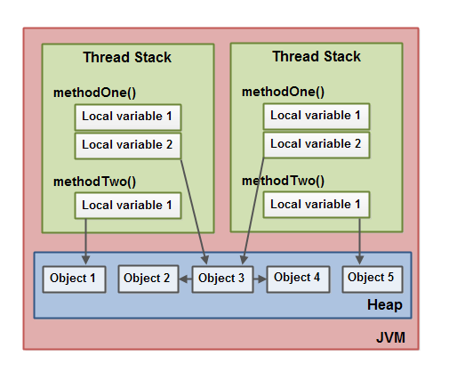
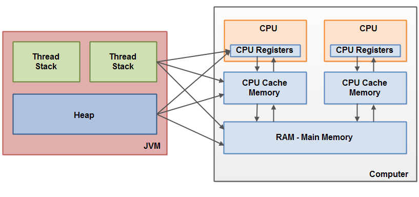

# 一、多线程的好处

1、cpu利用率更高（例如等待磁盘读取数据的时候，cpu可以去处理读取好的文件,避免线程读取文件时被阻塞的问题）

2、使服务器响应更快：监听请求的线程将请求传给工作者线程（worker thread），然后立刻回去监听请求

```java
while(server is active){
  listen for request;
  hand request to worker thread;
}
```

# 二、多线程的代价

1、设计更复杂

2、上下文切换开销大：上下文切换为当CPU从执行一个线程切换到执行另外一个线程的时候，它需要先存储当前线程的本地的数据，程序指针等，然后载入另一个线程的本地数据，程序指针等，最后才开始执行。这种切换称为“上下文切换”(“context switch”)。CPU会在一个上下文中执行一个线程，然后切换到另外一个上下文中执行另外一个线程。

3、除了cpu，线程还需要一些内存来维护其本地的堆栈，也需要占用操作系统中的一些资源来被管理，开销也会相对单线程程序大

# 三、线程安全及不可变形

1、竞态条件：当多个线程同时访问同一个资源，并且其中的一个或者多个线程对这个资源进行了写操作而产生（多个线程同时读同一个资源不会产生竞态条件。）

2、不可变的共享对象

例子如下：

```java
public class ImmutableValue{
  	private int value = 0;
  	public ImmutableValue(int value){
      	this.value = value;
  	}
  	public int getValue(){
      	return this.value;
  	}
}
```

其中，成员变量value是通过构造函数赋值的，而没有set方法，因此一旦该类被实例化，value值将是不能被修改的，拥有不可变性。

注：当一个变量是“只读”时，变量的值不能直接改变，但是可以在其它变量发生改变的时候发生改变。比如，一个人的出生年月日是“不变”属性，而一个人的年龄便是“只读”属性，但是不是“不变”属性。随着时间的变化，一个人的年龄会随之发生变化，而一个人的出生年月日则不会变化。这就是“不变”和“只读”的区别。

如果想要对`ImmutableValue`类实例进行操作，可以通过构建新一个实例来改变，例子如下：

```java
public class ImmutableValue{
  	private int value = 0;
  	public ImmutableValue(int value){
      	this.value = value;
  	}
  	public int getValue(){
      	return this.value;
  	}
  	public ImmutableValue add(int valueToAdd){
      	return new ImmutableValue(this.value + valueToAdd);
  	}
}
```

3、即使一个对象是线程安全的，指向这个对象的引用也可能是线程不安全的

线程不安全的对象例子如下：

```java
public void ThreadUnSafeObject{
  	private int value = 0;
  	private void setValue(int value){
      	this.value = value;
  	}
  	...
    
}
```

在这种情况下，一般会将set方法声明为同步方法，即加上锁。

自我体会：对象类的线程安全考虑一般会因为该对象的成员变量是全局变量而出现，多个线程对该变量的写操作可能会产生线程问题，例如以`HashMap`作本地全局变量缓存的自定义缓存类；而对于一般的业务对象类，我们在使用时通常都会重新实例化一个对象，该对象（资源）在线程间不是共享的，因此一般不用考虑线程安全。

# 四、java内存模型

1、java内存模型原理


如下图，在java虚拟机中每个线程都有各自的线程栈，一个线程创建的本地变量对于其他线程都是不可见的；如上图，调用栈和本地变量放在线程上，对象存放在堆上。

一个本地变量可能是原始类型，也可能是对某个对象的引用，存放在线程栈上面，但对象本身存放在堆上面；

一个对象的成员变量随着该对象存放在堆上面，无论是原始类型还是对象引用；

一个对象可能包含方法，这些方法可能包含本地变量。这些本地变量任然存放在线程栈上，即使这些方法所属的对象存放在堆上。

静态成员变量也存放在堆上面；




如上图所示（其中Object3持有Obj2和Obj4的一个引用作为成员变量），Obj3就相当于上述提到的`HashMap`作本地缓存的全局变量，两个线程的methodOne的本地变量都是指向Obj3的引用，而仅存在一个静态变量的拷贝，存放在堆上，Obj3被两个线程共享。而Obj1和Obj5相当于上述提到的业务对象，两个线程执行方法时会各自创建一个新的事例存放在堆上，其中Obj1和Obj5的对象类型可以是相同的。

2、java内存模型与硬件内存架构的连接



如上图所示，部分线程栈和堆可能会出现在cpu缓存、寄存器、主存中，当对象和变量被存放在计算机的各种不同的内存区域中，会出现一些问题，主要包括两个方面：

- 线程对共享资源的可见性
- 读、写共享变量时出现竞争条件

（1）当共享对象在主存内被初始化后，跑在cpu上的某个线程将该对象读到缓存中，然后对其修改；在cpu缓存没有被刷新到主存之前，共享对象的修改对于其他线程来说是不可见的，导致对象的数据不一致。此时可以使用`volatile`关键字解决，保证直接从主存内读取数据，数据直接被写进主存中

（2）当线程A读一个共享对象的成员变量count到cpu缓存中并加一，但缓存还没刷新进主存，而线程B也干了同样的事情，则count被加了两次，但刷新进主存中的count只是比原来大了一而已，此时可以使用java同步代码块（`synchronized`）解决。一个同步块可以保证每次只有一条线程进入代码的临界区，还可以保证代码块所有被访问的变量将从主存中读出，当线程退出代码块时，所有被更新的变量会被刷新到主存中，不管是不是被`volatile`声明。

# 五、java同步锁

```java
//同步方法
public synchronized void add(){
	...
}
//同步代码块
public void add(){
  	...
    synchronized (...){
      
    }
}
```

```java
//加锁方法的类
public class MyClass {

	public synchronized void log1() throws InterruptedException {
		System.out.println("thread name : "+Thread.currentThread().getName() + " log1");
		Thread.sleep(10000);
	}

	public synchronized void log2(String string) throws InterruptedException {
		/*synchronized (string){
			System.out.println("thread name : "+Thread.currentThread().getName() + " log2 " + string);
			Thread.sleep(10000);
		}*/
		System.out.println("thread name : "+Thread.currentThread().getName() + " log2 " + string);
		Thread.sleep(10000);
	}
}
//测试类
public class TestMyClass {
	private static MyClass myClass = new MyClass();
  
	public static void main(String[] args) throws InterruptedException {
		Thread thread = new Thread("thread1"){
			public void run(){
				try {
					myClass.log1();
				} catch (InterruptedException e) {
					e.printStackTrace();
				}
			}
		};
		thread.start();

		myClass.log2();
	}
}
```

先看上面例子，`MyClass`类中两个同步方法，其实是将整个类对象作为锁，在测试类中看到`main`线程调用的是`log2`方法，`thread1`调用的是`log1`方法，但实际执行时，程序会先执行两个方法中的其中一个，等执行完后再执行下一个方法；

而对于`synchronized(...){}`的同步代码块，括号中的值即为监控对象，也就是锁；当它为`this`时，则表示代码块的锁是该类对象，此时锁的效果和上面的锁加在方法上是一样的；如果和上述注释掉的代码一样是一个`string`参数，则代表它的锁是传进来的`string`参数，此时`main`线程和`thread1`线程可同时执行不同的方法（`log1`和`log2`）。

还有一点，上述代码中`main`线程和`thread1`线程共用一个`myclass`对象，因此会产生方法阻塞；但如果两线程不是引用同一个对象实例，则加的锁不是同一个对象实例，不会产生方法阻塞，两个线程可同时使用各自调用的方法。

# 六、ThreadLocal类

对于`ThreadLocal`类，即使两个线程共用同一个对象，两个线程依然看不到彼此的`ThreadLocal`变量域。

```java
public class ThreadLocalExample {
	public static class MyRunnable implements Runnable{

		private ThreadLocal<Integer> threadLocal = new ThreadLocal<>();

		@Override
		public void run() {
			threadLocal.set((int) (Math.random()*100D));
			try {
				Thread.sleep(10000);
			} catch (InterruptedException e) {
				e.printStackTrace();
			}
			System.out.println(Thread.currentThread().getName() + " : "+threadLocal.get());
		}
	}

	public static void main(String[] args) throws InterruptedException {
		MyRunnable myRunnable = new MyRunnable();

		Thread thread = new Thread(myRunnable);
		Thread thread1 = new Thread(myRunnable);

		thread.start();
		thread1.start();
	}
}
```

如上面例子，线程`thread`和`thread1`共用同一个`MyRunnable`变量，也即共用一个`ThreadLocal`对象。比如线程`thread`将公用对象设置一个int数据，睡眠三秒中，在这期间`thread1`将共用对象也设置了一个int数据，最后输出的数据不同，证明`thread1`线程设置的数据不会覆盖掉`thread`线程设置的值。


注：service方法中spring的事务注解`@Transactional`与`synchronized`配合使用时要注意`@Transactional`要等到整个service方法结束后才提交事务，如果在未提交事务之前另一个线程访问了`synchronized block`的话就会引起数据不同步,例如下面的例子，因为事务还未提交，数据库还没更新，可能会导致另一个线程判断到data为空并再执行一次save，从而导致有两条相同的数据

```java
@Transactional
public void service(){
  ...
  synchronized (xxx) {
    ...
    data = get();//从数据库搜索data
    if(data != null)
      	return;
    else
    	save(data);//数据存入数据库
  }
  ...
  ...
}
```

修改过后的代码

```java
@Transactional
public void service(){
  ...
  synchronized (xxx) {
    ...
    data = get();//从数据库搜索data
    if(data != null)
      	return;
    else
    	save(data);//数据存入数据库
  	...
  	...
  }
}
```

